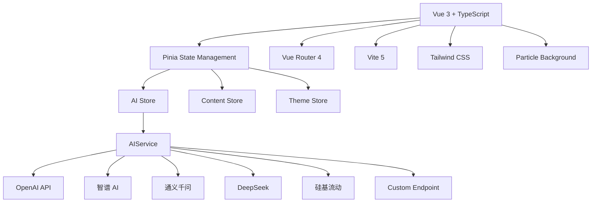

<div align="center">

# 🛒 电商军师

**AI 驱动的电商内容创作助手**

[](https://vuejs.org/)
[](https://www.typescriptlang.org/)
[](https://vitejs.dev/)
[](https://tailwindcss.com/)
[](https://pinia.vuejs.org/)
[](https://vercel.com)

⭐ **小范围分享的 AI 内容生成工具** | 支持 OpenAI、智谱、通义、DeepSeek、硅基流动

</div>

---

## 📸 功能特色

- **🤖 多模型支持**：集成 6 大 AI 提供商（OpenAI、智谱 AI、通义千问、DeepSeek、硅基流动、自定义）
- **🎨 多媒体生成**：文本内容创作、图像生成、视频生成一体化
- **💡 智能助手**：电商问答、文案优化、竞品分析、评价解读
- **📚 知识学院**：电商课程、行业知识库、最佳实践
- **🔧 实用工具**：价格计算、违禁词检测、SEO 分析、字数统计
- **📱 响应式设计**：完美适配桌面端和移动端，支持暗色模式

---

## 🚀 快速开始

### 环境要求

- Node.js 18+
- npm 或 yarn

### 安装与运行

```bash
# 克隆仓库
git clone https://github.com/pyf2818/E-commerce-Strategist.git
cd E-commerce-Strategist

# 安装依赖
npm install

# 启动开发服务器
npm run dev
# 访问 http://localhost:3000
```

### 生产构建

```bash
# 构建生产版本
npm run build

# 预览构建结果
npm run preview

# 代码检查
npm run type-check

# 代码规范检查
npm run lint
```

---

## ⚙️ 配置说明

首次使用需要在 **Settings（设置）** 页面配置 AI API Key：

1. **选择提供商**：OpenAI / 智谱 / 通义 / DeepSeek / 硅基流动
2. **输入 API Key**：从对应平台获取
3. **选择模型**：根据需求选择合适的模型
4. **保存配置**：自动保存到浏览器 localStorage

### 推荐配置

| 用途 | 推荐提供商 | 说明 |
|------|-----------|------|
| 文本聊天 | 智谱 GLM-4-Flash / DeepSeek | 免费额度多，响应快 |
| 图像生成 | 硅基流动 (Kolors) / 智谱 CogView | 效果好，成本低 |
| 视频生成 | 硅基流动 (Wan2.2) / 通义万相 | 质量优秀 |

---

## 🌐 在线访问

🔗 **[https://ecommerce-strategist.vercel.app](https://ecommerce-strategist.vercel.app)**

---

## 📦 技术架构



### 核心技术栈

| 技术 | 版本 | 用途 |
|------|------|------|
| Vue 3 | 3.4+ | 响应式前端框架 |
| TypeScript | 5.3+ | 类型安全 |
| Vite | 5.x | 构建工具 |
| Pinia | 2.x | 状态管理 |
| Vue Router | 4.x | 路由管理 |
| Tailwind CSS | 3.4 | 样式框架 |
| ESLint | 8.x | 代码检查 |

---

## 📁 项目结构

```
E-commerce Strategist/
├── src/
│   ├── components/          # 可复用组件
│   │   ├── common/         # 通用组件 (ModelSelector, ParticleBackground)
│   │   └── layout/         # 布局组件 (AppLayout, AppSidebar, AppHeader)
│   ├── views/              # 页面组件
│   │   ├── HomeView.vue           # 首页仪表板
│   │   ├── ContentCreatorView.vue # AI 内容创作
│   │   ├── AIAssistantView.vue    # 智能对话助手
│   │   ├── ImageGenView.vue       # AI 图像生成
│   │   ├── VideoGenView.vue       # AI 视频生成
│   │   ├── KnowledgeView.vue      # 知识学院
│   │   ├── ToolsView.vue          # 实用工具集
│   │   ├── TemplatesView.vue      # 模板库
│   │   ├── HistoryView.vue        # 历史记录
│   │   ├── SettingsView.vue       # 系统设置
│   │   └── NotFoundView.vue       # 404 页面
│   ├── stores/             # Pinia 状态存储
│   │   ├── ai.ts           # AI 配置与服务工厂
│   │   ├── content.ts      # 内容历史与收藏
│   │   └── theme.ts        # 主题管理
│   ├── services/           # 业务逻辑层
│   │   ├── ai.ts           # 多提供商 AI 服务
│   │   └── prompts.ts      # 系统提示词模板
│   ├── types/              # TypeScript 类型定义
│   │   └── ai.ts           # AI 相关类型与默认配置
│   ├── router/             # 路由配置
│   ├── utils/              # 工具函数
│   │   └── logger.ts       # 结构化日志工具
│   └── assets/             # 静态资源
├── public/                 # 公共文件
├── scripts/                # 开发脚本
│   └── deploy.ts           # 部署助手
├── .env.example            # 环境变量示例
├── vercel.json             # Vercel 部署配置
├── vite.config.ts          # Vite 配置
├── tailwind.config.js      # Tailwind CSS 配置
├── tsconfig.json           # TypeScript 配置
└── CLAUDE.md               # Claude Code 开发指南
```

---

## 🔌 AI 提供商支持

| 提供商 | 文本 | 图像 | 视频 | 流式输出 | 跨域支持 |
|--------|------|------|------|----------|----------|
| OpenAI | ✅ | ✅ | ✅ (Sora) | ✅ | ❌ |
| 智谱 AI (Zhipu) | ✅ | ✅ | ✅ | ✅ | ❌ |
| 通义千问 (Qwen) | ✅ | ✅ | ✅ | ❌ | ❌ |
| DeepSeek | ✅ | ❌ | ❌ | ✅ | ✅ |
| 硅基流动 (SiliconFlow) | ✅ | ✅ | ✅ | ✅ | ❌ |
| 自定义 | ✅ | ⚠️ | ⚠️ | ✅ | 取决于端点 |

---

## 🎯 核心功能

### 1. AI 内容创作
- 支持多平台文案生成（淘宝、京东、小红书、抖音等）
- 预设行业模板（美妆、数码、服饰、食品等）
- 自定义提示词和变量
- 导出 Markdown/纯文本

### 2. AI 图像生成
- 商品图生成：白底图、场景图、细节图
- 多种风格：真实照片、产品展示、生活场景、简约、艺术、3D
- 多尺寸支持：512×512、1024×1024、横版、竖版
- 自动优化提示词

### 3. AI 视频生成
- 商品展示视频
- 多种分辨率和时长
- 支持文生视频、图生视频

### 4. 智能助手
- 电商专业问答
- 价格策略建议
- 竞品分析
- 评价情感分析

### 5. 工具箱
- **定价计算器**：成本、利润、活动价计算
- **违禁词检测**：广告法 + 平台敏感词
- **字数统计**：文案字数、字符数
- **SEO 分析**：关键词密度、优化建议
- **图片尺寸库**：各平台图片规范

---

## 🔧 开发指南

### 添加新的 AI 提供商

参考 `src/services/ai.ts` 和 `src/types/ai.ts`：

1. 在 `AIProvider` 类型添加新枚举值
2. 在 `TEXT_PROVIDER_DEFAULTS`、`IMAGE_PROVIDER_DEFAULTS`、`VIDEO_PROVIDER_DEFAULTS` 添加默认配置
3. 在 `AIService` 类实现对应的 API 调用方法
4. 更新 Settings 页面的提供商选项
5. 在 `TEXT_MODELS`、`IMAGE_MODELS`、`VIDEO_MODELS` 添加支持的模型列表

### 添加新的页面

1. 创建 `src/views/NewPage.vue`
2. 在 `src/router/index.ts` 添加路由
3. 在 `src/components/layout/AppSidebar.vue` 添加导航项

### 代码规范

- **TypeScript**：严格模式，启用所有类型检查
- **Vue 3**：Composition API + `<script setup>`
- **样式**：Tailwind CSS 优先，自定义样式必须 scoped
- **日志**：使用 `src/utils/logger`，禁用 `console.log`
- **不可变性**：使用 spread operator 而非 mutation

详见 [CLAUDE.md](./CLAUDE.md) 开发规范。

---

## 🚀 部署

本应用为纯前端应用，可直接部署到 Vercel、Netlify、GitHub Pages 等平台。

### Vercel 部署（推荐）

```bash
# 1. 本地构建测试
npm run build

# 2. 安装 Vercel CLI
npm i -g vercel

# 3. 登录 Vercel
vercel login

# 4. 部署到生产环境
vercel --prod
```

详细部署步骤请查阅 [DEPLOY.md](./DEPLOY.md)。

---

## ⚠️ 重要注意事项

### CORS 跨域限制

这是一个纯前端应用，AI API 调用直接由浏览器发起。某些提供商（OpenAI、智谱、通义）可能因 CORS 策略拦截请求。

**解决方案**：
- 优先使用 **DeepSeek**（完全支持跨域）
- 安装浏览器插件 "Allow CORS" 或 "CORS Unblock"
- 自建 CORS 代理服务器

### API Key 安全

由于是纯前端架构，API Key 存储在用户的浏览器 localStorage 中，**会暴露给前端代码**。

**安全建议**：
- ❌ 不要将此应用部署为公开商业服务
- ✅ 仅供小范围分享（家人、朋友、团队内部）
- ✅ 让每个用户配置自己的 API Key
- ✅ 不要共享你的 API Key

### 生产环境建议

如需公开服务，建议：
1. 实现后端代理层（Vercel Serverless Functions）
2. 添加用户认证系统
3. 使用数据库存储用户配额
4. 实施速率限制
5. 添加请求日志监控

---

## 🤝 贡献

欢迎贡献！请遵循以下流程：

1. Fork 本仓库
2. 创建特性分支：`git checkout -b feature/AmazingFeature`
3. 提交更改：`git commit -m 'Add some AmazingFeature'`
4. 推送到分支：`git push origin feature/AmazingFeature`
5. 开启 Pull Request

---

## 📄 许可证

MIT License - 详见 [LICENSE](LICENSE) 文件

---

## 📞 支持与反馈

- **GitHub Issues**: https://github.com/pyf2818/E-commerce-Strategist/issues
- **开发文档**: 查看 [CLAUDE.md](./CLAUDE.md)
- **部署指南**: 查看 [DEPLOY.md](./DEPLOY.md)

---

## 🙏 致谢

感谢所有为这个项目提供灵感和帮助的开发者！

- [Vue.js](https://vuejs.org/) - 渐进式前端框架
- [Vite](https://vitejs.dev/) - 下一代前端构建工具
- [Tailwind CSS](https://tailwindcss.com/) - 实用优先的 CSS 框架
- [Pinia](https://pinia.vuejs.org/) - 直观的状态管理
- [OpenAI](https://openai.com/) / [智谱 AI](https://open.bigmodel.cn/) / [通义千问](https://dashscope.aliyun.com/) / [DeepSeek](https://platform.deepseek.com/) / [硅基流动](https://siliconflow.cn/) - 强大的 AI 能力

---

<div align="center">

**开始使用电商军师，让 AI 助力你的电商事业！** 🚀

Made with ❤️ by [pyf2818](https://github.com/pyf2818)

</div>
